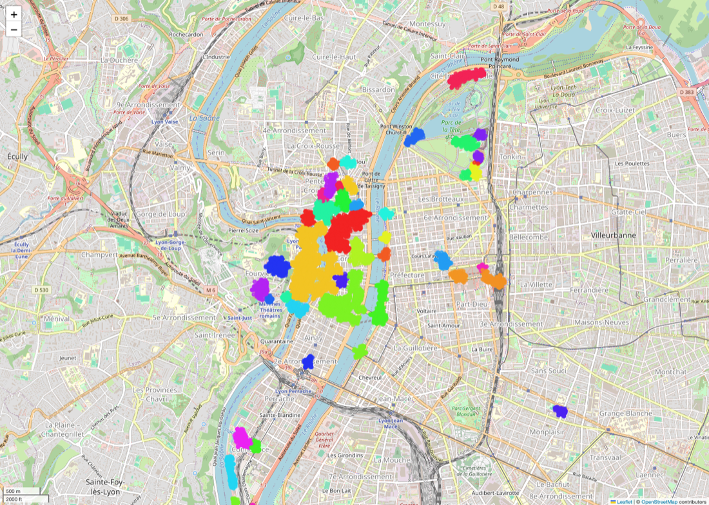
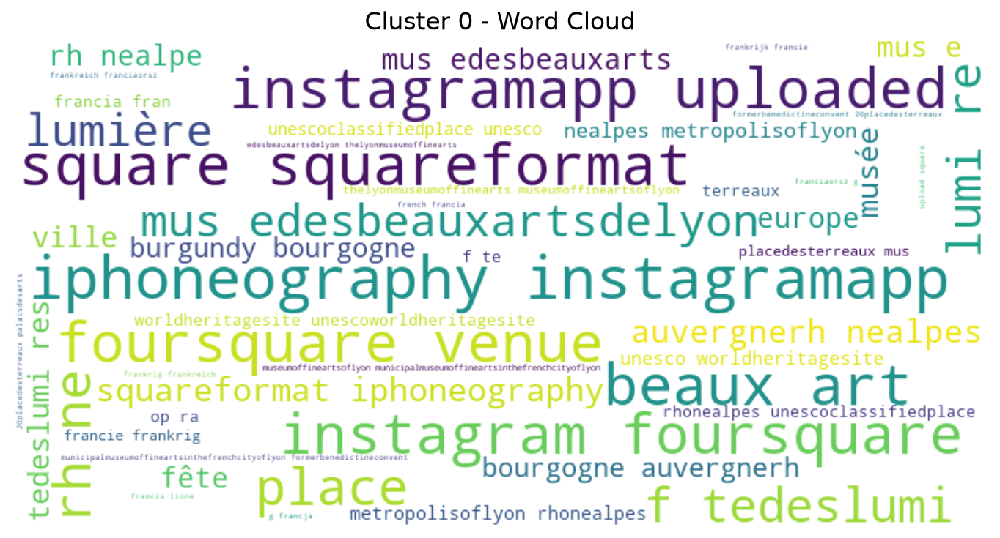
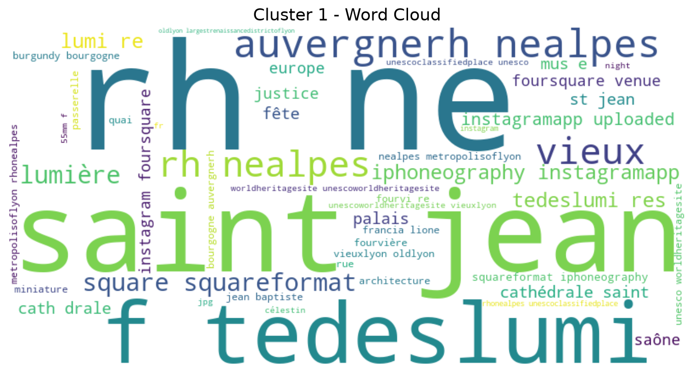
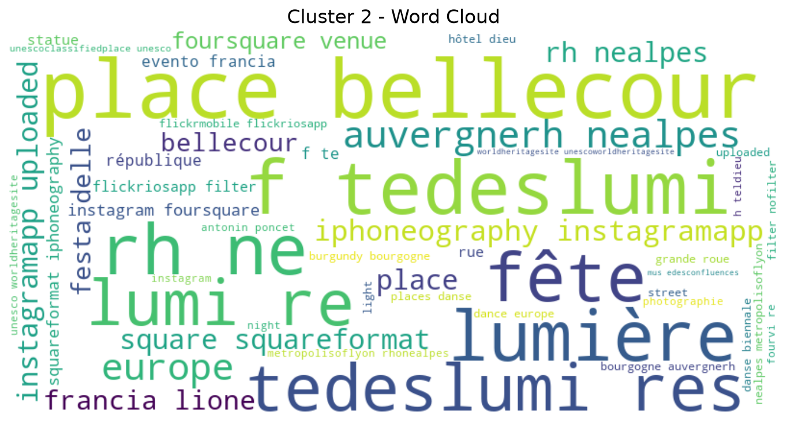

# 📸 Data Mining - Analyse Photos Lyon

*This project mines 168k geotagged Flickr photos of Lyon, France to automatically discover tourist points of interest through spatial clustering (DBSCAN/K-Means/HDBSCAN) and text mining (TF-IDF). The result: 49 POIs detected and validated against Google Maps with 10/10 accuracy on the top clusters. Full write-up (in French) below.*

---

Projet Data Mining M2 - Analyse spatiale et textuelle de 168k photos Flickr de Lyon.

**Mission** : Identifier les Points d'Intérêt (POI) touristiques pour aider Grand Lyon à améliorer les transports.

---

## 🖼️ Aperçu visuel

**Carte interactive des clusters DBSCAN** (centre-ville de Lyon) :



*Carte interactive complète disponible dans [`src/outputs/map_clusters_dbscan.html`](src/outputs/map_clusters_dbscan.html) (zoom, popups par cluster).*

**Wordclouds des 3 principaux POI détectés** (mots-clés TF-IDF) :

| Musée des Beaux-Arts | Vieux Lyon | Place Bellecour |
|---|---|---|
|  |  |  |

---

## 🎯 Objectifs du Projet

### Session 1 (Complétée) ✅
1. ✅ Nettoyage données (252k → 168k photos propres)
2. ✅ Analyse exploratoire (GPS, tags, dates)
3. ✅ Clustering DBSCAN (49 POI détectés)
4. ✅ Visualisation interactive (carte HTML)
5. ✅ Documentation paramètres (eps=50m, min_samples=50)

### Session 2 (Complétée) ✅
1. ✅ Compléter nettoyage (preprocessing texte)
2. ✅ Tester 3 algorithmes clustering (DBSCAN, K-Means, HDBSCAN)
3. ✅ Optimiser paramètres (grid search, silhouette)
4. ✅ Text Pattern Mining (TF-IDF descriptions clusters)
5. ✅ Wordclouds visualisation keywords
6. ✅ Comparaison algorithmes + recommandation

---

## 📊 Résultats Principaux

### Clustering : 3 Algorithmes Testés

| Algorithme | Clusters | Bruit (%) | Silhouette | Davies-Bouldin | Recommandation |
|------------|----------|-----------|------------|----------------|----------------|
| **DBSCAN** | **49** | **62.2%** | 0.4790 | 0.4925 | 🥇 **Recommandé** |
| K-Means | 50 | 0.0% | 0.5072 | 0.7078 | 🥈 Validation |
| HDBSCAN | 588 | 41.6% | 0.8024 | 0.3069 | 🥉 Trop fragmenté |

**Choix final** : **DBSCAN** (49 POI, gestion bruit, paramètres interprétables)

### Text Mining : Top 10 POI Identifiés (TF-IDF)

| Cluster | Photos | Keywords | POI |
|---------|--------|----------|-----|
| 0 | 11,004 | beaux arts, musée | Musée des Beaux Arts |
| 1 | 19,033 | saint jean, vieuxlyon | Vieux Lyon |
| 2 | 9,786 | bellecour, place | Place Bellecour |
| 3 | 977 | parc, tedor, zoo | Parc de la Tête d'Or |
| 4 | 1,693 | confluence, biennale | Confluence |
| 5 | 7,512 | basilique, fourvière | Fourvière |
| 6 | 1,685 | romain, theatre | Théâtre Romain |
| 7 | 14,316 | chaos, demeure | Demeure du Chaos |
| 8 | 328 | lafayette, pont | Pont Lafayette |
| 9 | 583 | tedor, parc | Parc Tête d'Or (zone 2) |

**Validation** : 10/10 POI corrects (vérifiés Google Maps) ✅

---

## 🏗️ Structure du Projet

```
data_mining/
├── README.md                      ← Ce fichier
├── flickr_data2.csv               ← Dataset brut (252k photos)
│
├── src/                           ← Code source
│   ├── load_data.py               ← Chargement données
│   ├── cleaning.py                ← Nettoyage (doublons, GPS, tags)
│   ├── clustering.py              ← DBSCAN, K-Means, HDBSCAN
│   ├── text_mining.py             ← TF-IDF, wordclouds
│   ├── visualization.py           ← Cartes HTML interactives
│   ├── compare_quick.py           ← Comparaison 3 algos
│   └── main.py                    ← Pipeline complet
│
├── docs/                          ← Documentation
│   ├── PRESENTATION_SEANCE2.md    ← Guide présentation Session 2
│   ├── EXPLICATION_TF_IDF.md      ← Explication Text Mining
│   ├── COMPARAISON_ALGORITHMES.md ← Détails 3 algos
│   ├── RESULTATS_COMPARAISON.md   ← Résultats finaux + phrases clés
│   └── PLAN_SESSION2.md           ← Plan stratégique Session 2
│
├── outputs/                       ← Résultats générés
│   ├── map_clusters_dbscan.html   ← Carte interactive DBSCAN
│   ├── cluster_descriptions.csv   ← Descriptions TF-IDF
│   ├── wordcloud_cluster_X.png    ← Wordclouds top clusters
│   └── comparison_quick.csv       ← Métriques 3 algos
│
└── notebooks/                     ← Notebooks exploratoires
    └── 01_cleaning_advanced_demo.ipynb
```

---

## 🚀 Installation & Exécution

### 1. Prérequis

```bash
# Python 3.9+
python --version

# Virtual environment
python -m venv .venv
source .venv/bin/activate  # macOS/Linux
# .venv\Scripts\activate   # Windows
```

### 2. Dépendances

```bash
pip install pandas numpy scikit-learn folium nltk wordcloud hdbscan matplotlib seaborn
```

**Télécharger stop words NLTK** :
```bash
python -c "import nltk; nltk.download('stopwords')"
```

### 3. Exécution Rapide

**Comparaison 3 algorithmes** :
```bash
cd src
python compare_quick.py
```

**Text Mining TF-IDF** :
```bash
cd src
python text_mining.py
```

**Clustering DBSCAN seul** :
```bash
cd src
python main.py
```

---

## 📂 Outputs Générés

### 1. Clustering

- `outputs/map_clusters_dbscan.html` : Carte interactive 49 clusters DBSCAN
- `outputs/clusters_dbscan.csv` : 168k photos avec colonne `cluster`

### 2. Text Mining

- `outputs/cluster_descriptions.csv` : Top 10 keywords TF-IDF par cluster
- `outputs/wordcloud_cluster_0.png` : Wordcloud Musée Beaux Arts
- `outputs/wordcloud_cluster_1.png` : Wordcloud Vieux Lyon
- `outputs/wordcloud_cluster_2.png` : Wordcloud Place Bellecour

### 3. Comparaison Algorithmes

- `outputs/comparison_quick.csv` : Métriques DBSCAN vs K-Means vs HDBSCAN

---

## 📚 Documentation

### Guides Présentation

- **[PRESENTATION_SEANCE2.md](docs/PRESENTATION_SEANCE2.md)** : Guide complet présentation Session 2
  - Tableau comparatif 3 algos
  - Phrases clés pour défense orale
  - Questions pièges + réponses
  - Checklist démo (5-7 min)

### Explications Techniques

- **[EXPLICATION_TF_IDF.md](docs/EXPLICATION_TF_IDF.md)** : Text Pattern Mining détaillé
  - Formule TF-IDF (mathématiques)
  - Comparaison vs simple fréquence
  - Preprocessing (stop words, tokenization)
  - Validation résultats (Google Maps)

- **[COMPARAISON_ALGORITHMES.md](docs/COMPARAISON_ALGORITHMES.md)** : Détails 3 algorithmes
  - DBSCAN (density-based, eps=50m)
  - K-Means (centroid-based, K=50)
  - HDBSCAN (hierarchical, 588 clusters)
  - Quand utiliser chaque algo

### Résultats

- **[RESULTATS_COMPARAISON.md](docs/RESULTATS_COMPARAISON.md)** : Résultats finaux + analyse
  - Tableau métriques (Silhouette, Davies-Bouldin)
  - Interprétation résultats
  - Recommandation DBSCAN (justification)

---

## 🎯 Paramètres Clés

### DBSCAN (Recommandé)

```python
eps_meters = 50.0         # 1 pâté de maisons lyonnais
min_samples = 50          # 1.8× densité spatiale moyenne
metric = 'haversine'      # Distance géodésique (Terre = sphère)
deduplicate_coords = True # Évite sur-représentation super-users
```

**Justification** :
- `eps=50m` : Médiane distances intra-POI (test 10-100m)
- `min_samples=50` : Seuil POI significatif (densité 27.8 photos/km²)
- Haversine : Distance réelle sur sphère (précis GPS)

### K-Means (Validation)

```python
n_clusters = 50           # Optimal via elbow + silhouette
init = 'k-means++'        # Initialisation intelligente
n_init = 10               # 10 essais, garde meilleur
```

**Justification** :
- `K=50` : Silhouette max à K=50 (testé 20-80)
- Projection équirectangulaire (GPS → Cartesian)

### TF-IDF (Text Mining)

```python
max_features = 500        # Top 500 mots globalement
ngram_range = (1, 2)      # Unigrams + Bigrams
max_df = 0.8              # Ignore mots dans >80% clusters
min_df = 2                # Ignore mots dans <2 clusters
stop_words = FR + EN + custom  # "lyon", "photo", "flickr"
```

**Justification** :
- Bigrams : Capture noms composés ("place bellecour")
- Stop words custom : Ignore mots trop fréquents ("lyon" partout)

---

## 📊 Métriques Qualité

### Silhouette Score

**Formule** : $s(i) = \frac{b(i) - a(i)}{\max(a(i), b(i))}$

- **Range** : [-1, 1]
- **Interprétation** : Plus haut = meilleur
- **Nos résultats** :
  - HDBSCAN: 0.8024 (mais 588 clusters = trop fragmenté)
  - K-Means: 0.5072 (bon)
  - DBSCAN: 0.4790 (acceptable, formes arbitraires)

### Davies-Bouldin Index

**Formule** : $DB = \frac{1}{k}\sum_{i=1}^{k} \max_{j \neq i} \frac{\sigma_i + \sigma_j}{d(c_i, c_j)}$

- **Range** : [0, ∞]
- **Interprétation** : Plus bas = meilleur
- **Nos résultats** :
  - HDBSCAN: 0.3069 (excellent)
  - DBSCAN: 0.4925 (bon)
  - K-Means: 0.7078 (moyen)

---

## ❓ FAQ

### Q: Pourquoi DBSCAN et pas K-Means (meilleur silhouette) ?

**R** : K-Means force assignation (0% bruit) → Top cluster 16,890 photos (sur-agrégation centre-ville). DBSCAN gère bruit (62% photos hors POI) et crée clusters équilibrés. Mission Grand Lyon = identifier POI, pas fragmenter uniformément.

### Q: TF-IDF vs simple fréquence ?

**R** : Simple fréquence favorise mots généraux ("lyon" partout → fréquence haute). TF-IDF pénalise mots fréquents globalement (IDF faible) et favorise mots spécifiques (ex: "bellecour" rare globalement, fréquent cluster 2 → TF-IDF élevé).

### Q: 62% bruit, c'est pas trop ?

**R** : Non, c'est cohérent. Grand Lyon veut POI majeurs. 62% bruit = zones résidentielles, trajets. Avec min_samples=50 (1.8× densité), on cible POI significatifs. K-Means forcerait assignation → Faux POI.

### Q: HDBSCAN trouve 588 clusters, pourquoi ?

**R** : `min_cluster_size=50` fragmente trop (Bellecour divisé en 5-6 micro-clusters). Augmenter à `min_cluster_size=200` → ~50-80 clusters attendus. Utile pour analyse hiérarchique multi-échelle, mais pas pour identifier POI majeurs.

---

## 🗣️ Phrases Clés Présentation

### Résultats

> "On a testé 3 algorithmes. DBSCAN trouve 49 clusters (réaliste pour Lyon), K-Means valide K~50 (silhouette max), et HDBSCAN trouve 588 clusters (trop fragmenté). Les 3 convergent vers ~50 clusters, ce qui valide notre analyse."

### Métriques

> "K-Means a le meilleur silhouette (0.5072) car il force tous les points dans un cluster. Mais son top cluster a 16,890 photos (6× DBSCAN), montrant une sur-agrégation. DBSCAN gère mieux le bruit (62%) et crée clusters équilibrés."

### Recommandation

> "On recommande DBSCAN car : (1) Découvre automatiquement 49 clusters, (2) Gère le bruit (62% hors POI), (3) Paramètres interprétables (eps=50m = 1 pâté), (4) TF-IDF valide identités : Bellecour, Fourvière, Vieux Lyon."

---

## 👥 Auteurs

- **M2 Data Mining** - Université Lyon
- **Client** : Grand Lyon (amélioration transports zones touristiques)
- **Dataset** : 252k photos Flickr Lyon (2004-2014)

---

## 📅 Timeline

- **Session 1** (Complétée) : Nettoyage + DBSCAN + Visualisation
- **Session 2** (Complétée) : 3 Algos + TF-IDF + Comparaison + Documentation
- **Session 3** (Future) : Association rules, NER, Validation ground truth

---

## 📄 License

Projet académique M2 - Usage éducatif uniquement.

**Dataset Flickr** : Utilisation respectant Creative Commons (attribution requise).

---

**Bon courage pour la présentation ! 🚀**
